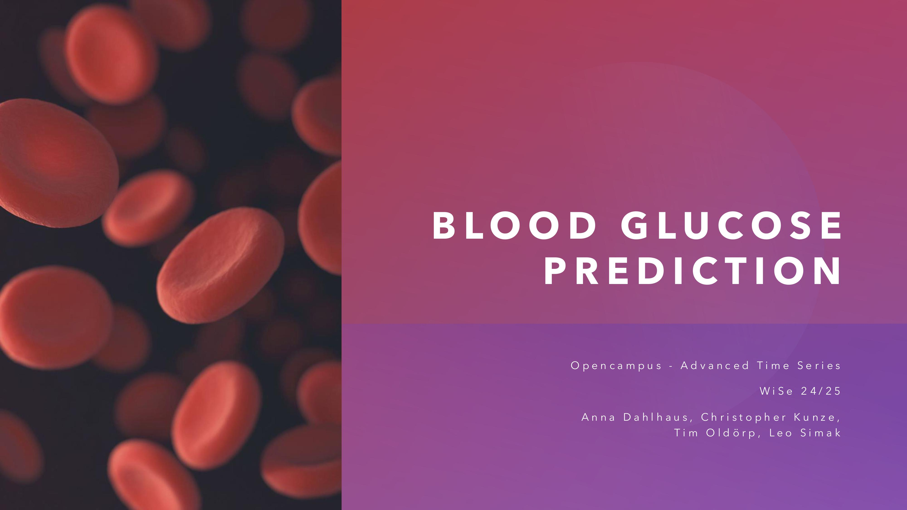

# Blood Glucose Forecasting

## Repository Link

[https://github.com/ChristopherKunze-Git/AdvancedTimeSeriesCourse-Engineering-Data]

## Context 
Diabetes mellitus stellt eine große gesellschaftliche Herausforderung dar. Weltweit sind Millionen Menschen auf eine kontinuierliche Blutzuckerkontrolle angewiesen, um gefährliche Über- (Hyperglykämie) oder Unterzuckerungen (Hypoglykämie) zu vermeiden. Unkontrollierte Blutzuckerschwankungen können zu schwerwiegenden Langzeitfolgen wie Herz-Kreislauf-Erkrankungen, Nervenschäden oder Nierenerkrankungen führen. Eine präzise Vorhersage des Blutzuckerspiegels könnte daher die Lebensqualität der Betroffenen erheblich verbessern, indem sie frühzeitig Gegenmaßnahmen ergreifen können, sei es durch Insulindosierung, Nahrungsaufnahme oder körperliche Aktivität. 

## Abstract (deutsch)
Das Projekt „Blood Glucose Prediction“ befasst sich mit der Vorhersage von Blutzuckerwerten bei Patienten mit Typ-1-Diabetes anhand von Zeitreihenmodellen. Ziel ist es, Blutzuckerwerte eine Stunde im Voraus vorherzusagen, um Betroffenen eine bessere Therapieplanung zu ermöglichen. Grundlage der Analyse ist das HUPA-UCM Diabetes Dataset, das kontinuierliche Blutzuckermessungen, Insulindosierungen, Kohlenhydrataufnahmen sowie Fitness-Tracker-Daten wie Schritte, Herzfrequenz und Kalorienverbrauch von 25 Patienten über mehrere Tage enthält.

Zu Beginn der Analyse zeigten sich einige Herausforderungen in der Datenqualität. Die Daten sind ungleichmäßig verteilt, da über 50 % der Messwerte von nur einem einzigen Patienten stammen, während einige Patienten nur sehr wenige Datenpunkte liefern. Zudem sind für bestimmte Patienten einzelne Variablen nicht oder nur unvollständig erfasst. Um die Qualität der Daten zu verbessern, wurden verschiedene Imputationsmethoden angewendet, darunter lineare Interpolation sowie Multiple Imputation mit Chained Equations (MICE) für fehlende Herzfrequenzwerte. Darüber hinaus wurden Feature Engineering-Techniken eingesetzt, um aussagekräftige Merkmale für die Modellierung zu extrahieren. Beispielsweise wurden stark korrelierte Variablen wie Kohlenhydrataufnahme und Insulindosis bereinigt und durch robustere Alternativen ersetzt. Zudem wurden zeitabhängige Merkmale wie die Tageszeit (sin/cos-codiert) sowie Lag-Features zur Berücksichtigung früherer Blutzuckerwerte eingeführt.

Im Rahmen der Modellierung wurden verschiedene Methoden getestet, die von einfachen Baseline-Ansätzen bis hin zu modernen Deep-Learning-Architekturen reichen. Die naive Methode, bei der der letzte gemessene Blutzuckerwert als Vorhersage verwendet wird, diente als Referenzmodell und erzielte bereits eine überraschend gute Performance mit einem RMSE von 27.0 und einer MAPE von 17.0 %. Darauf aufbauend wurden statistische Modelle wie ARIMA und SARIMA getestet, die jedoch keine deutliche Verbesserung gegenüber der Baseline zeigten. Baumbasierte Modelle wie Random Forest und XGBoost erwiesen sich hingegen als wesentlich leistungsfähiger. Random Forest erzielte mit einem RMSE von 16.8 und einer MAPE von 11.2 % die besten Ergebnisse, während XGBoost mit RMSE 17.6 und MAPE 11.9 % ebenfalls gut abschnitt. Neuronale Netze wie LSTM, GRU und N-Hits wurden ebenfalls evaluiert, blieben jedoch teilweise hinter den baumbasierten Methoden zurück. LSTMs, die für ihre Fähigkeit zur Modellierung langanhaltender Trends bekannt sind, schnitten mit RMSE 18.3 und MAPE 12.7 % zwar besser ab als naive Methoden, konnten aber die Ergebnisse der baumbasierten Modelle nicht übertreffen. Zusätzlich wurde das Foundation Model Chronos getestet, welches bereits ohne spezifisches Training für Zeitreihenvorhersagen genutzt werden kann. Überraschenderweise blieb Chronos mit einem RMSE von 27.0 auf dem Niveau der naiven Methode und konnte auch nach ersten Finetuning-Versuchen nicht verbessert werden.

Die Ergebnisse zeigen, dass baumbasierte Modelle die beste Performance erzielten, während tiefe neuronale Netze und Foundation Models trotz ihres theoretischen Potenzials noch nicht die gewünschten Verbesserungen brachten. Dies könnte darauf zurückzuführen sein, dass die zur Verfügung stehenden Daten stark limitiert sind und neuronale Netze von größeren Datensätzen profitieren würden. Ein weiteres Problem könnte die fehlende Berücksichtigung externer Faktoren sein, die den Blutzuckerspiegel beeinflussen, wie Stress, Schlafqualität oder individuelle metabolische Eigenschaften der Patienten.

Um die Vorhersagequalität weiter zu verbessern, sollten zukünftige Arbeiten sich auf eine Erweiterung der Features konzentrieren. Denkbar wäre die Integration anthropometrischer Merkmale wie Alter, Geschlecht und Gewicht sowie detailliertere Informationen über Mahlzeiten, Schlafverhalten und Aktivitätsniveaus. Auch eine optimierte Datenaufbereitung durch robustere Imputationsverfahren oder alternative Feature-Transformationsmethoden könnte die Modelle weiter verbessern. Zudem könnten Hybridansätze aus baumbasierten und neuronalen Netzen getestet werden, um das Beste aus beiden Welten zu kombinieren.

Zusammenfassend zeigt das Projekt, dass die Vorhersage des Blutzuckerspiegels eine anspruchsvolle Aufgabe ist, bei der einfache Methoden bereits solide Ergebnisse liefern. Während klassische statistische Modelle nur begrenzte Fortschritte erzielten, erwiesen sich baumbasierte Modelle als vielversprechendste Lösung. Tiefe neuronale Netze und Foundation Models benötigen möglicherweise weitere Optimierungen oder größere Datensätze, um ihr volles Potenzial auszuschöpfen. Künftige Arbeiten sollten sich darauf konzentrieren, zusätzliche Kontextfaktoren in die Modellierung einzubeziehen und die Datenqualität weiter zu verbessern, um präzisere und zuverlässigere Vorhersagen zu ermöglichen.

## Description

The goal of the project is to use time series forecasting methods to predict blood glucose levels in diabetic patients 1 hour in advance.

### Task Type

Regression

### Dataset

We use the HUPA-UCM Diabetes Dataset, which includes data from 25 individuals with Type 1 Diabetes Mellitus (T1DM). The dataset consists of:
- Continuous Glucose Monitoring (CGM) data (over several days, >7d)
- Fitness tracker data (steps, heart rate, burned calories, sleep)
- Carbohydrate intake and insulin dosages (basal + bolus)
- Preprocessed 5-minute interval data

### Summary

Model   |   RMSE   |   MAPE

Naive   |   27.0   |   17.0%

ARIMA   |   25.9   |   17.4%

RandomForest   |   16.8   |   11.2%

XGBoost   |   17.6   |   11.9%

LSTM   |   18.3   |   12.7%

GRU   |   23.8   |   14.3%

N-Hits   |   23.8   |   14.9%

Chronos (zero-shot)   |   27.0   |   17.0%

**Best Model:** Random Forest (RMSE: 16.8, MAPE: 11.2%)
  
### Result

- Most models performed only slightly better than the naive baseline.

- Tree-based models (Random Forest, XGBoost) achieved the best results.

- Deep learning models (LSTM, GRU, N-Hits) performed worse than tree-based models.

- Chronos (zero-shot) performed comparably to naive forecasting.

### Outlook

- Further feature engineering:

    - Anthropometrics (age, gender, height, etc.)

    - Sleep tracking data

    - Time since last meal, average activity level

- Explore additional model architectures and training strategies.

## Documentation

1. **[Literature Review](0_LiteratureReview/README.md)**
2. **[Dataset Characteristics](1_DatasetCharacteristics/exploratory_data_analysis.ipynb)**
3. **[Baseline Model](2_BaselineModel/baseline_model.ipynb)**
4. **[Model Definition and Evaluation](3_Model/model_definition_evaluation)**
5. **[Presentation](4_Presentation/README.md)**

## Cover Image

